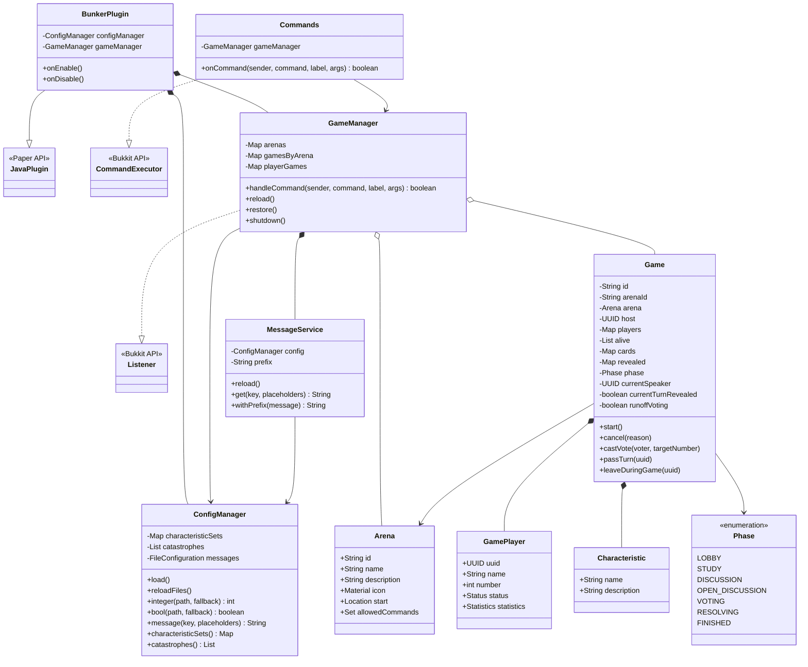
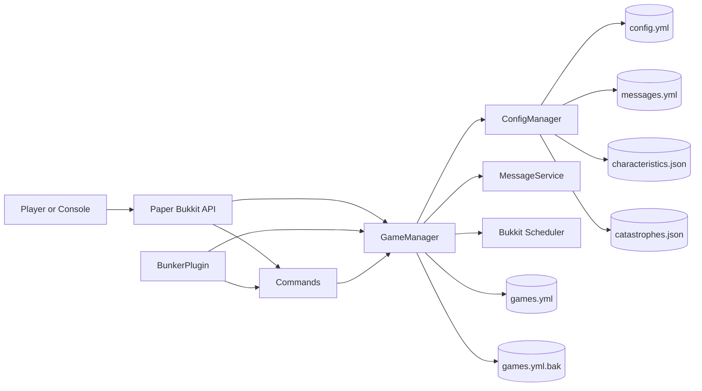
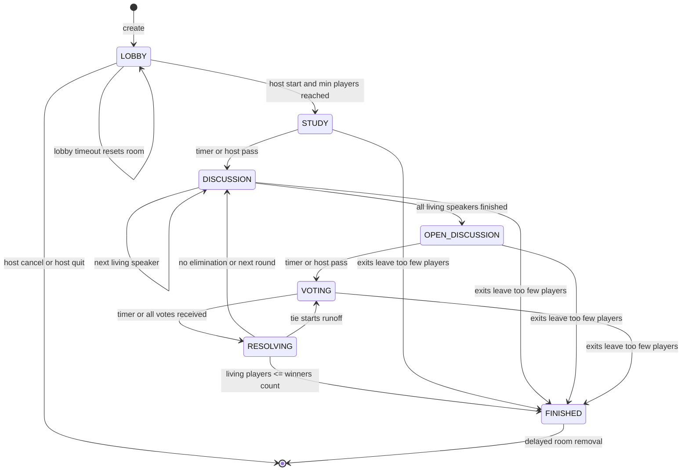
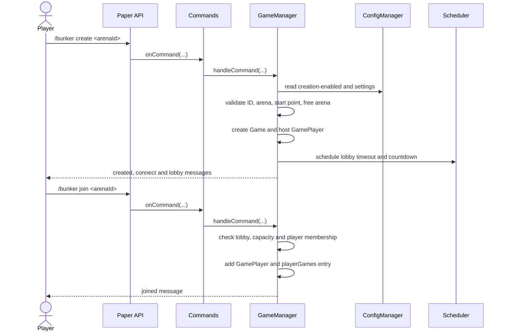
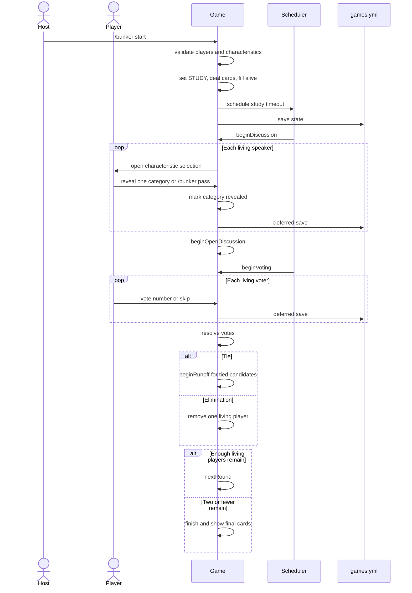
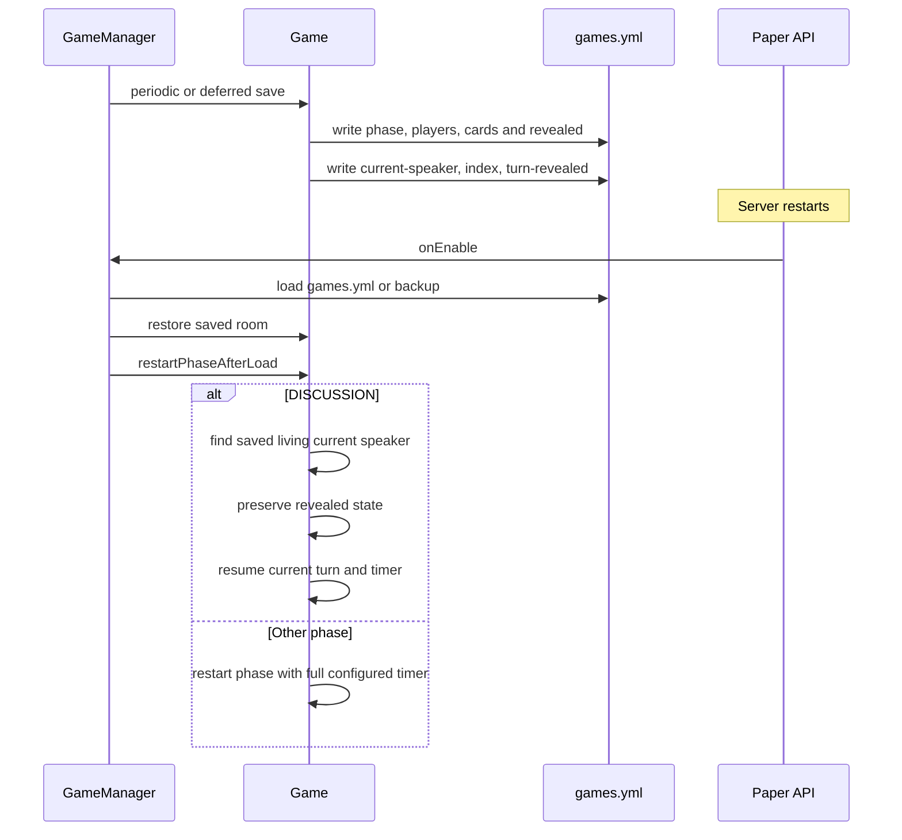
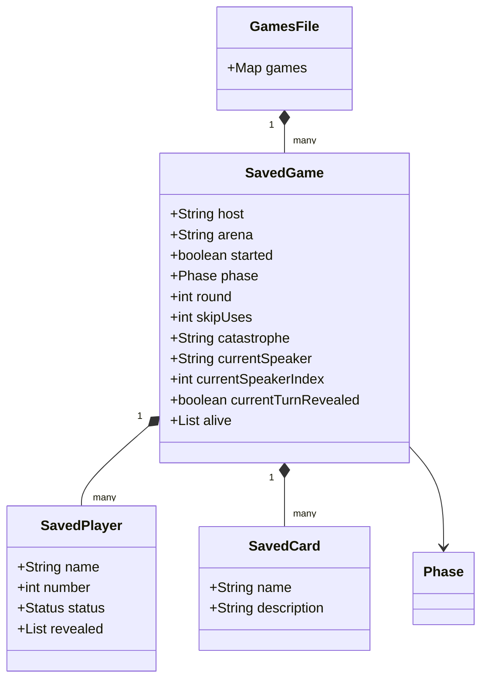
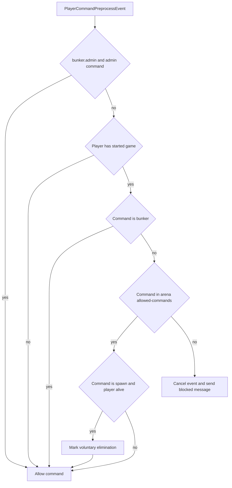
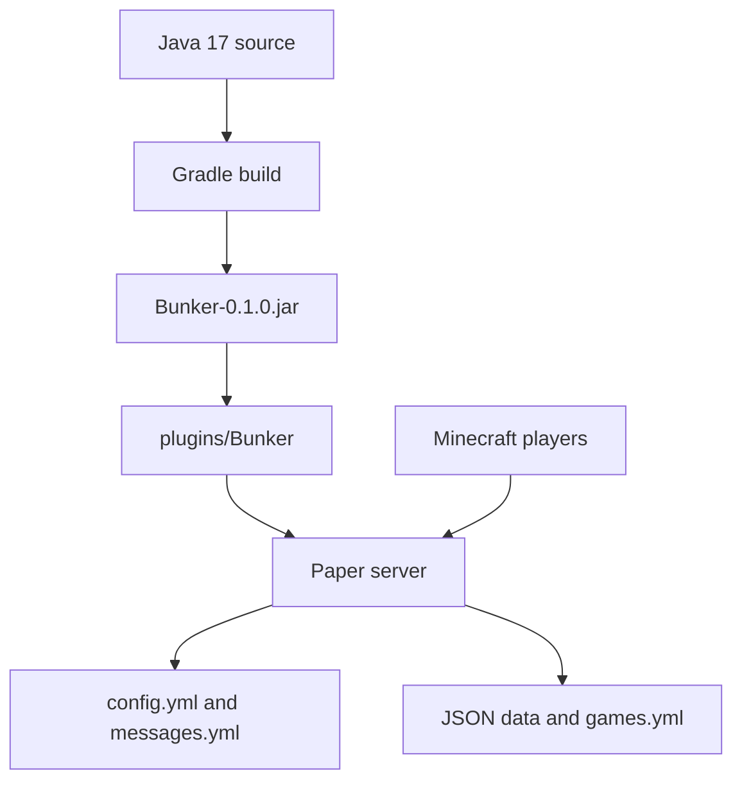

# UML-диаграммы проекта Bunker

Диаграммы отражают текущую реализацию проекта. Они используют Mermaid и отображаются в GitHub, GitLab, многих IDE и Markdown-просмотрщиках.

## 1. Диаграмма классов

## 2. Компоненты и зависимости

## 3. Жизненный цикл игровой комнаты

## 4. Создание игры и подключение игроков

## 5. Запуск, ход и голосование

## 6. Рестарт и восстановление текущего хода

## 7. Сохранение данных комнаты

Фактически эти данные записываются в YAML-раздел `games`. `games.yml.bak` содержит предыдущую успешно сохранённую версию. При загрузке повреждённые комнаты отбрасываются, а раскрытые категории без соответствующей карты очищаются.

## 8. Обработка команд во время игры

## 9. Развёртывание

## Ограничения текущих диаграмм

- `runoffVoting` и список кандидатов повторного голосования не сохраняются и после рестарта начинают обычное голосование.
- Таймер текущей фазы после рестарта начинается заново с полным значением.
- Изменение настроек арены через reload не переписывает объект арены уже созданной комнаты.
